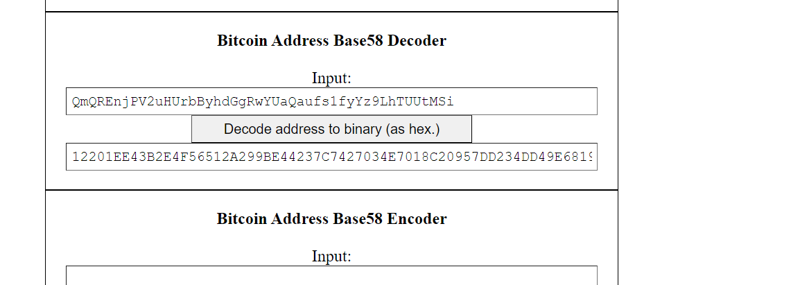
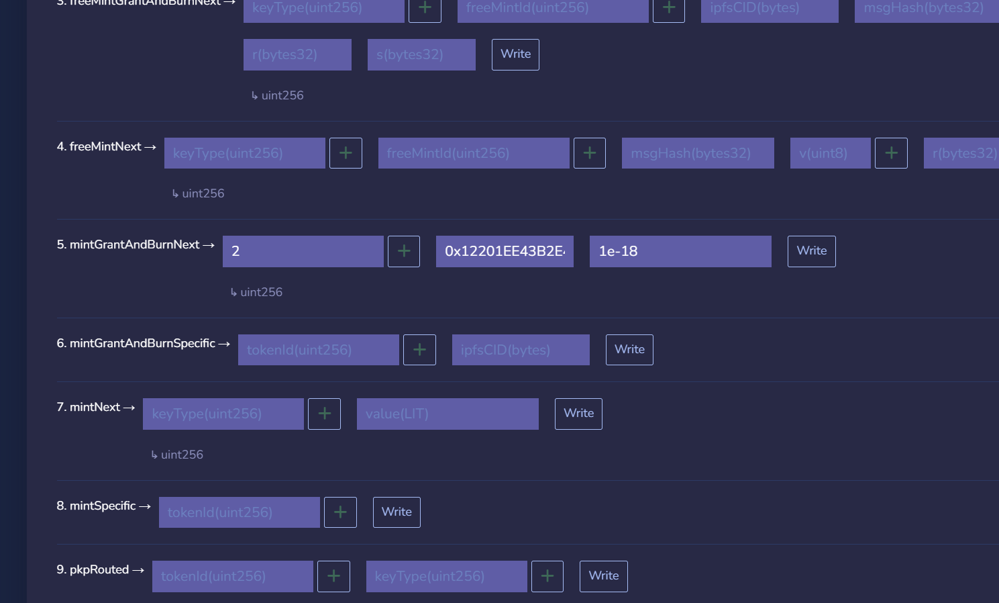

# SafeMail
Decentralized Email <> Email transfers using Lit Protocol and the Safe SDK.

### Short Description
SafeMail is a simple way to send tokens to any google email address, even if they're not in crypto yet. No private keys, no wallets, just a google sign-in. Fund it with some tokens and you're good to go.

### Why this?
Sending transactions on Ethereum can be complex for the average non-crypto user. ETH addresses, wallets, gas, etc are all huge turnoffs, and although we've successfully been able to abstract some layers of this, there are many ways to go. In order to bring the next billion users to crypto, we need to reduce the learning curve to get into crypto.

## Architecture
SafeMail is a simple way to send tokens to any google email address, even if they're not in crypto yet. No private keys, no wallets, just a google sign-in. Fund it with some tokens and you're good to go.

#### Safe 
By leveraging Safe's Create2 contracts, a safe can be derived from a specific email address, and consistently computed using the same email address and owner. By using Account Abstraction and smart contract wallets, we can avoid needing private keys. Furthermore, we use the Gelato SDK to automate the execution of transactions, so that the user doesn't need to pay gas fees.

#### Lit Protocol
Lit Protocol enables us to use Lit Actions - computing JS code stored on IPFS in a decentralized way. This allows to securely verify if an OAUTH token is valid and corresponds to the right email address (OAUTH tokens are valid for 1 hour). From that verification, we can get the safe address that wants to be used, and send execute any transaction from that safe to a recipient email address.

#### Creating A Lit Action PKP using Mint/Grant/Burn

1. Upload the code to IPFS

2. Decode the CID: http://lenschulwitz.com/base58 

3. Mint a PKP: https://lit-protocol.calderaexplorer.xyz/token/0x8F75a53F65e31DD0D2e40d0827becAaE2299D111/write-contract

#### Creating a Safe via a Lit Action
1. Create a Lit Action with Mint/Grant/Burn and the steps above 

2. The Lit Action calls the Safe Factory contract with the email address as the salt, and the owner as the Lit Action PKP.

3. The Safe Factory contract creates a new Safe using the Create2 pattern. This process enables anyone to create a Safe for any email address, and the Safe will be consistently computed using the same email address and owner.